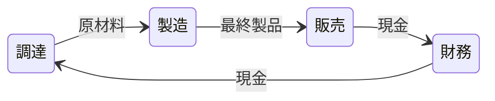

# 財務の指標

経営の財務的側面は，バリューチェーンのループを完結させることと言えます。
バリューチェーンとは，原材料を最終製品に加工し，その製品を販売して現金を得て，その現金で新たな原材料を調達するという新陳代謝のようなプロセスです。

↑ バリューチェーンの模式図

## 決定変数となるもの
* 短期投資
* 国債
* 株式
  * 投資可能な銘柄
    * 百貨店（GM）
    * ガレージ
* 社債
  > 企業が資金調達のために発行する債券。投資家はこの債券を購入し，企業に資金を提供。企業は定期的に利息を支払い，満期時に元本を返済する。
* クレジットライン(与信極度額)
  > 銀行などから借入できる上限額
* 配当金
  > 企業が利益の一部を株主に還元するために支払う金銭のこと。配当は通常，四半期ごとや年に一度，株主に対して支払われる。

## 意思決定について
会社の現金に責任を持って管理することは重要である。常に新たな原材料を入手するための十分な現金を確保するとともに，会社は，すぐに現金化できる流動資産を，適切なリターンが得られるような安全な投資先に投資をしなければならない。

* 企業が給与，購入代金の支払，利息の支払等を履行できるように十分な現金を持つべきである。
* 社債の発行により，長期的な流動性ニーズを見込む必要がある。
  > 社債を発行することで，企業は一度に大量の資金を調達し，その資金を長期的なプロジェクトや投資に充てることができる。
* 短期的な余剰流動性は賢く投資すべきである。
  > 賢く投資することで，必要な時にはすぐに現金化できる。突然の資金需要にも対応できる。
* 長期的な余剰流動性は以下に投資すべきである。
  * 国債
  * 株式（百貨店（GM），ガレージ）
* 余剰資金を株主に配当として分配すべきである

あなたは，貸借対照表の資産欄にある現金や現金同等物の状況を確認することで財務管理の適切性を評価できる。